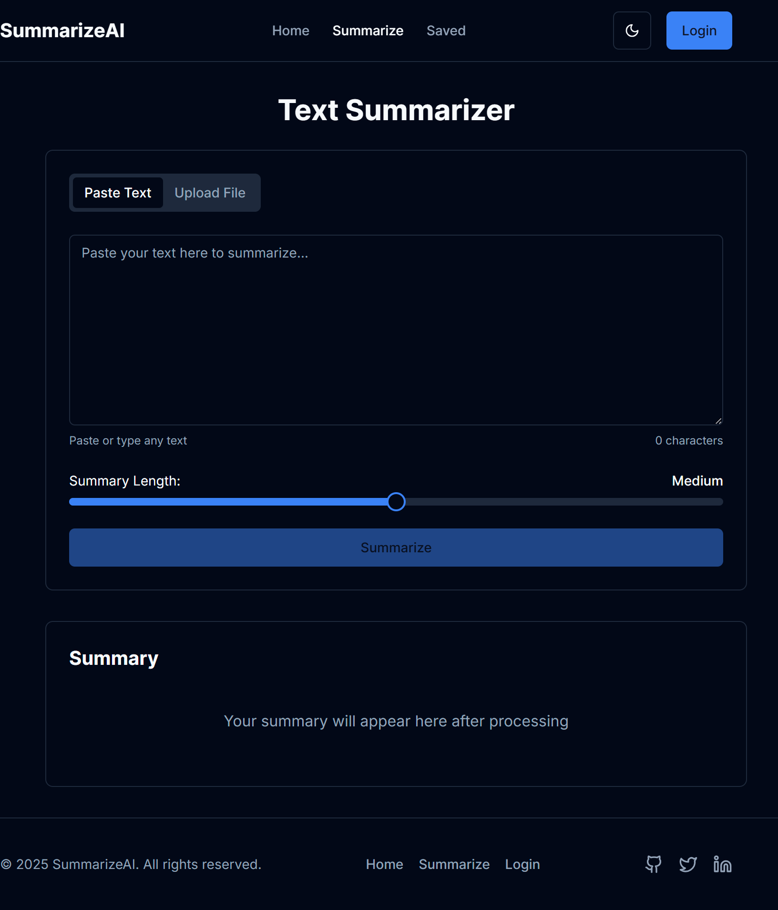
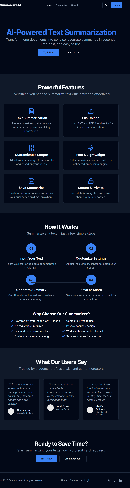

# SummarizeAI - AI-Powered Text Summarization

SummarizeAI is a web application that uses AI to generate concise summaries of long texts. It's built with Next.js for the frontend and a Python backend for the summarization logic.

## Features

*   **Text Summarization:** Paste your text or upload a file to get a summary.
*   **File Upload:** Supports various file formats for summarization.
*   **Customizable Summary Length:** Adjust the length of the summary to your needs.
*   **Save Summaries:** Registered users can save their summaries for later access.
*   **Secure & Private:** Your data is never shared with third parties.
*   **User Authentication:** Login and registration functionality.

## Screenshots

### Main Page


### Login Page


## Getting Started

### Prerequisites

*   Node.js and pnpm
*   Python and pip

### Installation

1.  **Clone the repository:**
    ```bash
    git clone https://github.com/your-username/SummarizeAI.git
    cd SummarizeAI
    ```

2.  **Install frontend dependencies:**
    ```bash
    pnpm install
    ```

3.  **Install backend dependencies:**
    ```bash
    pip install -r backend/requirements.txt
    ```

### Running the application

1.  **Start the frontend development server:**
    ```bash
    pnpm dev
    ```

2.  **Start the backend server:**
    ```bash
    python backend/app.py
    ```

Open [http://localhost:3000](http://localhost:3000) with your browser to see the result.

## Technologies Used

*   **Frontend:**
    *   Next.js
    *   React
    *   TypeScript
    *   Tailwind CSS
    *   Shadcn UI
*   **Backend:**
    *   Python
    *   Flask
    *   Transformers
    *   PyTorch
*   **Database:**
    *   Firebase
